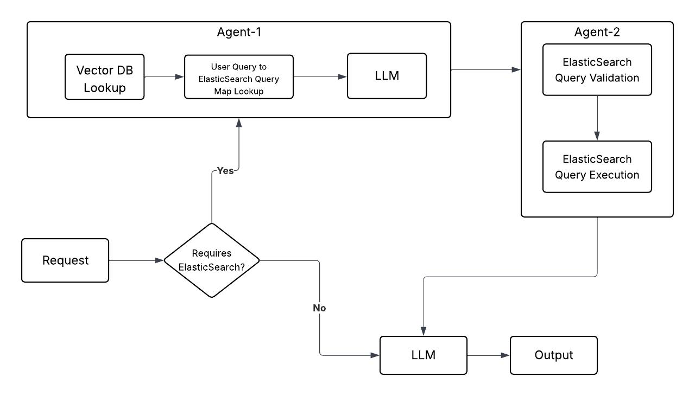

# Demo Project for Agentic RAG

The source code in this repository is just a proof of concept of the idea that an approach like this would work.

The idea is to build an Agentic RAG workflow that when used could help in generating query responses in Natural Language.

## What does the POC do?

In the POC codebase, we do not incorporate agents. We perform the work an agent should do everytime the query is made.
This means, if the user query is not relevant to ElasticSearch, it still would run the process of generating an ElasticSearch query and executing it against the ElasticSearch.

Further, there is no guardrails in the POC version which means it will not be checking if the query is only going to perform read-only operations. We cannot afford a fully-automated pipeline to perform write/delete operations.

Lastly, the user queries are expected to be repetitive for a particular ElasticSearch schema. This means, having a record of all user queries, corresponding ElasticSearch queries would help in speeding up Agent runtimes by preventing Agent to be executed everytime.

**Modules**

1. Fake Data Generator --> Uses Python's Faker library to populate synthetic data in ElasticSearch.
2. LLM ES Agent --> Allows to use LLMs to interact with the ElasticSearch

## Next steps

In the workflow shown, there are 2 agents being used one after another. These can be clubbed to one agent as well as both will be used in sequence anyways. The only benefit here is if the user request already contains a Query, it would allow us to directly move to Agent-2 in future versions.

`Requires ElasticSearch` decision making can be done with a small classification model that can help in determining if the request should be sent to an Agent or directly to LLM. We can ofcourse use LLMs with native tool calling abilities which could determine if they would benefit from using Agents. But for production ready systems, I generally recommend a decision maker which we can independently debug and test.

For `Agent-1`, we first perform a Vector DB lookup which helps in identifying if the user query is already similar to any existing query we have used `Agent-1` earlier for. If there is a match, we can then get the corresponding query that previous LLM wrote directly from the database. Otherwise, we can use an LLM (from testing, OpenAI LLMs perform better on ElasticSearch query writing in comparison to Open Source models like LLaMA) to generate queries and accordingly update Vector database with the response.

For `Agent-2` we first have a guardrail that validates the input query for ElasticSearch is a read-only operation. If not, we do not proceed with the request. If it is read-only, we execute it to get a response from ElasticSearch.

Lastly, we use the input query and Agent-2 response to generate the final output in natural language.

# Tying to InsightSoftware

This can be used in scenarios where Audit Logs are saved in ElasticSearch and can help in determining the user level accesses quickly.

After introducing additional agents (for example, getting date) can help in answering more sophisticated queries (for example, which user with admin permissions modified entity 123 yesterday?) without the user having to know any knowledge of ElasticSearch by themselves.