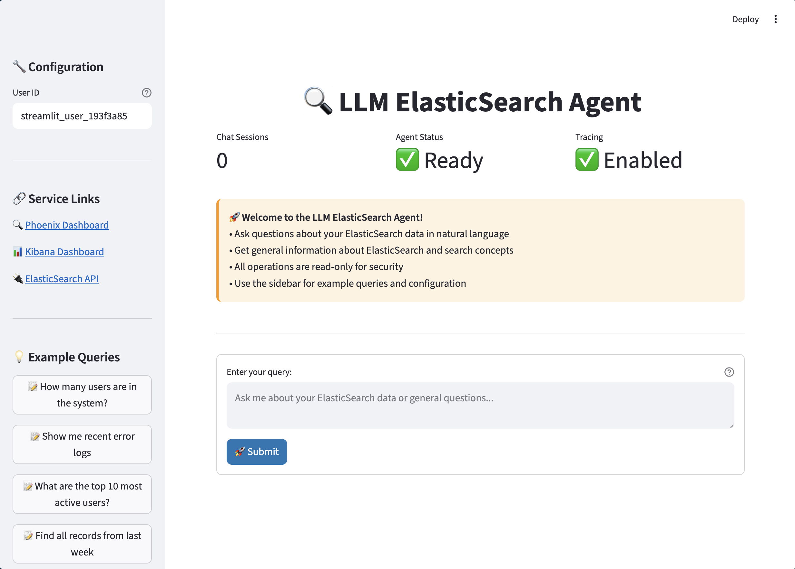

# LLM ElasticSearch Agent

An intelligent agent system that combines Large Language Models (LLMs) with ElasticSearch to provide natural language querying capabilities for your data. The system uses Google's Agent Development Kit (ADK) and includes comprehensive observability through Arize Phoenix.

## 🚀 What It Does

This application creates an intelligent agent that can:

- **Natural Language Queries**: Ask questions about your data in plain English
- **ElasticSearch Integration**: Automatically discovers indices, analyzes schemas, and executes queries
- **Multi-Agent Architecture**: Uses specialized agents for different tasks (orchestration, query generation, execution)
- **Observability**: Full tracing and monitoring through Arize Phoenix
- **Interactive Terminal**: Real-time conversation interface with the agent
- **Security**: Read-only operations to protect your data

### Example Interactions

```
You: How many users are in the system?
Agent: [Discovers indices, finds user data, executes count query, returns results]

You: Show me recent error logs from last week
Agent: [Finds log indices, constructs time-based query, returns formatted results]

You: What are the top 10 most active users?
Agent: [Analyzes user activity data, creates aggregation query, presents insights]
```

## 🏗️ Architecture

### System Components

```
┌─────────────────┐    ┌─────────────────┐    ┌─────────────────┐
│   User Input    │───▶│   Orchestrator  │───▶│  Query Agent    │
│   (Terminal)    │    │     Agent       │    │                 │
└─────────────────┘    └─────────────────┘    └─────────────────┘
                                │                        │
                                ▼                        ▼
┌─────────────────┐    ┌─────────────────┐    ┌─────────────────┐
│ Arize Phoenix   │    │ Index Selection │    │ Query Execution │
│ (Observability) │    │     Agent       │    │     Agent       │
└─────────────────┘    └─────────────────┘    └─────────────────┘
                                                        │
                                                        ▼
                                              ┌─────────────────┐
                                              │  ElasticSearch  │
                                              │    Cluster      │
                                              └─────────────────┘
```

### Agent Hierarchy

1. **Orchestrator Agent**: Main coordinator that routes queries and manages workflow
2. **Query Generation Agent**: Converts natural language to ElasticSearch queries
3. **Index Selection Agent**: Discovers and selects appropriate indices
4. **Query Execution Agent**: Safely executes read-only operations
5. **Pipeline Agent**: Handles complex multi-step operations

### Technology Stack

- **Python 3.12**: Core application runtime
- **Google ADK**: Agent framework and orchestration
- **ElasticSearch 8.11**: Data storage and search engine
- **OpenAI GPT-4**: Language model for natural language processing
- **LiteLLM**: Multi-provider LLM integration
- **Arize Phoenix**: Observability and tracing
- **Kibana**: ElasticSearch data visualization
- **Docker & Docker Compose**: Containerization and orchestration

## 🛠️ Setup & Execution

### Prerequisites

- Docker and Docker Compose installed
- OpenAI API key
- At least 4GB RAM available for ElasticSearch

### Quick Start

1. **Clone and navigate to the project:**
   ```bash
   git clone https://github.com/Japkeerat/ElasticSearch-with-LLM
   cd ElasticSearch-with-LLM
   ```

2. **Set up environment variables:**
   ```bash
   cp .env.example .env
   # Edit .env and add your OpenAI API key
   ```

3. **Start all services:**
   ```bash
   docker-compose up -d
   ```

4. **Wait for services to be ready (check health):**
   ```bash
   docker-compose ps
   ```

5. **Connect to the interactive agent:**
   
   Visit http://0.0.0.0:8501 for the streamlit service

   

### Service Access Points

- **LLM Agent**: http://localhost:8501
- **Kibana Dashboard**: http://localhost:5601
- **Phoenix Observability**: http://localhost:6006
- **ElasticSearch API**: http://localhost:9200

### Environment Configuration

Edit your `.env` file with the following required variables:

```bash
# Required: OpenAI API Key
OPENAI_API_KEY=your_openai_api_key_here

# Auto-configured by Docker Compose
ES_HOST=http://elasticsearch:9200
PHOENIX_ENDPOINT=http://phoenix:6006

# Optional customization
LOG_LEVEL=INFO
APP_NAME=llm_es_agent
USER_ID=user_001
```

## ⚙️ Configuration

The system supports configurable models for each agent through a simple `config.yaml` file. This allows you to optimize costs and performance by using different models for different tasks.

### Model Configuration

Create or edit `config.yaml` in the project root:

```yaml
agents:
  orchestrator: "openai/gpt-4o-mini"
  elasticsearch: "openai/gpt-4o-mini"
  index_selection: "openai/gpt-3.5-turbo" 
  query_generation: "openai/gpt-4o-mini"
  query_execution: "openai/gpt-4o-mini"
```

### Supported Models
This is tested with `openai/gpt-4o-mini` but should work with any model and provider supported with LiteLLM. To replicate results, I'll suggest to use `openai` API and use `openai/gpt-4o-mini` (default in configurations).


## 📊 Usage Examples

### Basic Data Queries
```
You: List all available indices
You: How many documents are in the user index?
You: Show me the schema of the logs index
```

### Complex Analytics
```
You: What are the most common error types in the last 24 hours?
You: Show me user activity patterns by hour
You: Find all failed login attempts from last week
```

### General Questions
```
You: How does ElasticSearch work?
You: Explain the difference between a query and a filter
You: What is this agent capable of?
```

## 🔧 Development

### Local Development (without Docker)

1. **Install dependencies:**
   ```bash
   pip install -r requirements.txt
   ```

2. **Set up local ElasticSearch and Phoenix**

3. **Run the application:**
   ```bash
   python main.py
   ```

### Project Structure

```
├── llm_es_agent/           # Core agent modules
│   ├── agents/             # Individual agent implementations
│   ├── tools/              # ElasticSearch tools and utilities
│   ├── config.py           # Configuration management system
│   ├── orchestrator.py     # Main orchestrator logic
│   └── pipeline_agent.py   # Pipeline management
├── prompts/                # Agent instruction templates
├── config.yaml             # Agent model configuration
├── main.py                 # Application entry point
├── requirements.txt        # Python dependencies
├── test_config_system.py   # Configuration system tests
├── CONFIGURATION_GUIDE.md  # Detailed configuration guide
├── Dockerfile             # Container configuration
├── docker-compose.yml     # Multi-service orchestration
└── .env.example          # Environment template
```

## 🔒 Security Features

- **Read-Only Operations**: Only search, aggregation, and discovery operations allowed
- **Query Validation**: All queries validated before execution
- **No Write Access**: Create, update, delete operations are blocked
- **Containerized**: Isolated execution environment
- **Non-Root User**: Application runs with limited privileges

## 📈 Monitoring & Observability

### Arize Phoenix Dashboard
- Real-time trace visualization
- Performance metrics
- Agent interaction flows
- Error tracking and debugging

### Logging
- Structured logging to files and console
- Configurable log levels
- Request/response tracking
- Error details and stack traces

## 🛑 Troubleshooting

### Common Issues

1. **Services not starting**: Check Docker resources and port availability
2. **ElasticSearch connection failed**: Verify ES_HOST environment variable
3. **OpenAI API errors**: Check API key validity and rate limits
4. **Phoenix not accessible**: Ensure port 6006 is available

### Useful Commands

```bash
# Check service status
docker-compose ps

# View logs for specific service
docker-compose logs elasticsearch
docker-compose logs llm-es-agent

# Restart services
docker-compose restart

# Clean restart (removes data)
docker-compose down -v && docker-compose up -d
```

